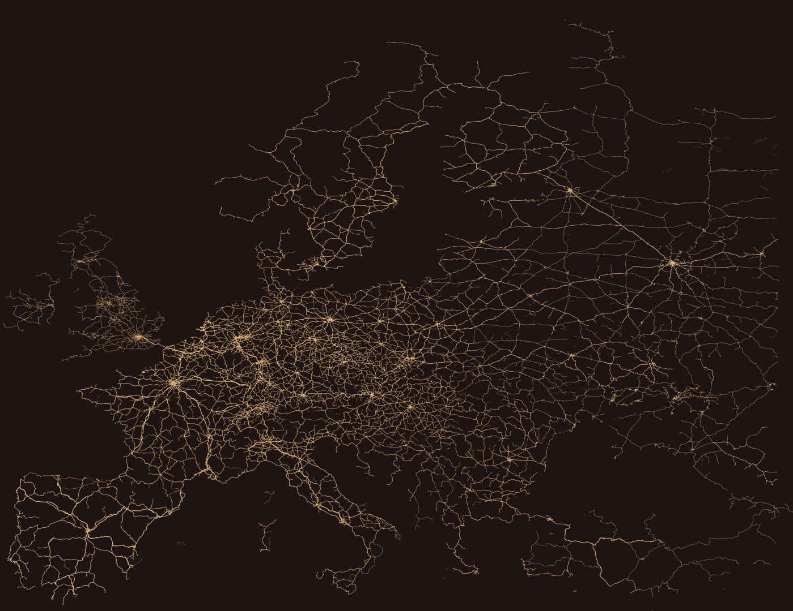

# TRAINer
A project about creating a beautiful map of trains for a selected area.



## Table of contents

- [TRAINer](#trainer)
  - [Table of contents](#table-of-contents)
  - [How to use](#how-to-use)
    - [Requirements](#requirements)
    - [How to run](#how-to-run)
    - [Command line arguments](#command-line-arguments)
  - [Licensing](#licensing)


## How to use

### Requirements

- .NET 8.0

### How to run

1. Clone the repository
2. Obtain the data from [OpenStreetMap](https://www.openstreetmap.org/) as an .osm.pbf file and save it in `data/raw`. You can use [Geofabrik](https://download.geofabrik.de/) to download the data.
3. Filter the data. You can use [Osmosis](https://wiki.openstreetmap.org/wiki/Osmosis) to filter the data. The final file should be `data/raw/rail.osm.pbf` The following command will filter the data to only include railways and save it in `data/raw`:
```shell
# Obtain only railway related
osmium tags-filter -o rail.osm.pbf -t --output-format pbf,add_metadata=false europe-latest.osm.pbf "w/railway=bridge,goods,light_rail,monorail,narrow_gauge,rail,subway,tram"
```
4. Run the program
```shell
dotnet run --project TAINEer
```
5. The output will be saved in `data/output`

### Command line arguments

Additional command line arguments can be passed to the program. The following arguments are available:

| Argument | Description | Default |
| --- | --- | --- |
| `--data` | The path to the data directory | `data` |
| `--min-lat` | Minimum latitude of the area to be processed | `-90` |
| `--max-lat` | Maximum latitude of the area to be processed | `90` |
| `--min-lon` | Minimum longitude of the area to be processed | `-180` |
| `--max-lon` | Maximum longitude of the area to be processed | `180` |
| `--color-main` | Color of the railway with the largest gauge. Colors are interpolated between the main and secondary color. | `#FFBA4A` |
| `--color-secondary` | Color of the railway with the smallest gauge. Colors are interpolated between the main and secondary color. | `#D5B690` |
| `--color-background` | Color of the background | `#1E1414` |

## Licensing

This project is licensed under the MIT License - see the [LICENSE](LICENSE) file for details.

This project uses the [OsmSharp](https://github.com/OsmSharp/core), [SkiaSharp](https://github.com/mono/SkiaSharp) and [System.CommandLine](https://github.com/dotnet/command-line-api) libraries.
